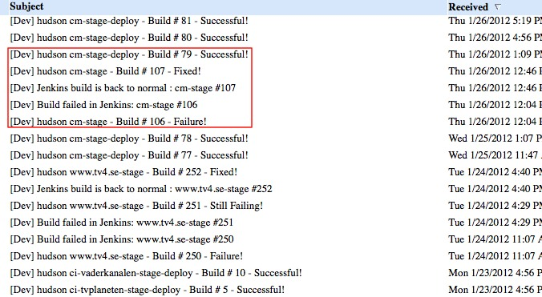

!SLIDE center
the bad

!SLIDE center

can't deploy deploy everything at will.

!SLIDE center

CMS

.notes stage goes out immediately.
OBS takes about 30 minutes to do release to stage (20 to prod) and editors cannot publish during deploy. 
for a news site that can be a catastrophe.

!SLIDE center

wordpress

.notes 300 blogs that use custom wordpress themes. 
started having all of wordpress in git. 
made deploys and upgrades hard.  
cut it down to wp-content and wp-admin that needs to be checked when upgrading wordpress.
deploys to stage and prod go out within 2 minutes of a commit.
OBS wordpress one plugin between having not having a site. how safe is that really?

!SLIDE center

mule

.notes mule ESB an integration server.  
great that you can hot deploy but can't deploy everything at will
like planning system (20 years of tv schedules) or the video archive.
after testing with test/unit, rspec, cucumber it's way harder than it should be.

!SLIDE center transition=fade

.notes only broken or fixed mail
0 inbox kinda hard w/ 50 mail a day
easy for developers to ignore a mail.
we send mail when something breaks or is deployed as that is
something that should be noticed.
