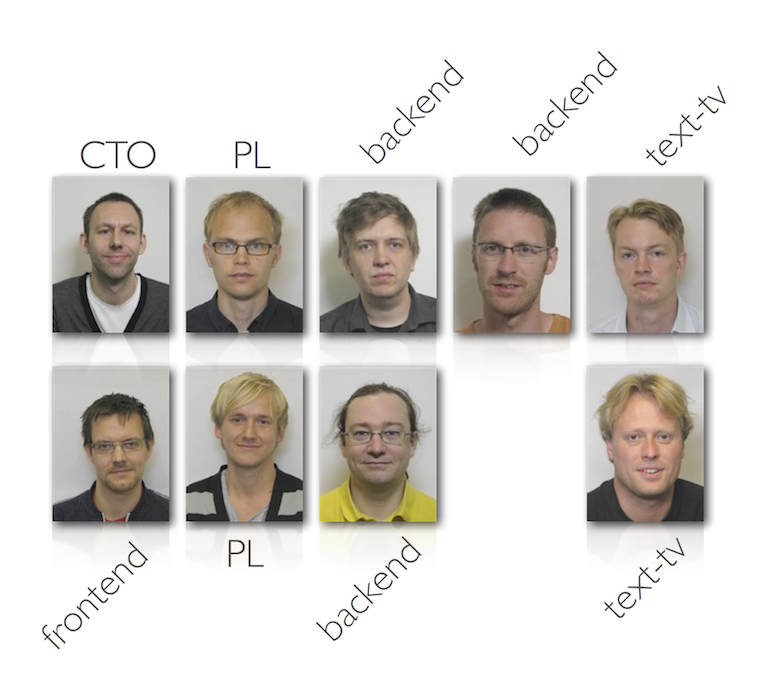

!SLIDE 
# Continuous Integration 
the good, bad and ugly 

!SLIDE center 

~~~SECTION:notes~~~

Swedens largest commercial TV channel
900~ employees
10 channels and 25 local stations
 www.tv4.se, www.tv4play.se
~~~ENDSECTION~~~

!SLIDE center 

~~~SECTION:notes~~~

tv4 digital media
4 full time developers plus consultants - 0 - 6
java, ruby, php, node
operations and development

~~~ENDSECTION~~~

!SLIDE bullets 
#who am i
* developer - shackled to a cms 10+ years
* operations
* java/ruby/jruby

~~~SECTION:notes~~~

have worked mainly with legacy java cms systems, lucene, solr, ruby

~~~ENDSECTION~~~
