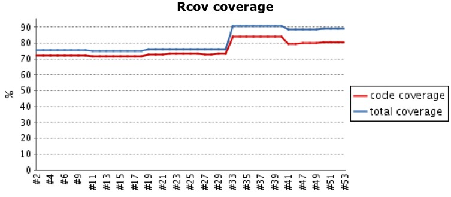

!SLIDE 
2007-8 cms migration

~~~SECTION:notes~~~

Migration from custom cms to 'off' the shelf solution.
1.000.000 line java/jsp/html/js/xml don't read to much into this as
there 140.000 lines javascript. lots of cut and paste.
15 testcases 738 lines
deployed prod irregular but could go as long as every 6-8 weeks

~~~ENDSECTION~~~

!SLIDE  transition=fade

~~~SECTION:notes~~~

one group of developers/business managers per site. no processes.
may not be bad but engineering practices didn't exist either
long time between deploy process
silos everywhere

~~~ENDSECTION~~~

!SLIDE  transition=fade

start small

~~~SECTION:notes~~~

cause you have nothing to begin with

~~~ENDSECTION~~~

!SLIDE bullets center transition=fade
* consistency
* os
* build tools (ant/maven)
* editor (intellij)
* can it compile?

~~~SECTION:notes~~~

may not seem like much but all these small differences added up.

~~~ENDSECTION~~~

!SLIDE center transition=fade

first jenkins server

~~~SECTION:notes~~~

same machine as my development environment.

~~~ENDSECTION~~~

!SLIDE center transition=fade
    java -jar jenkins.war

~~~SECTION:notes~~~

one terminal, one jar, a little configuration and your off!

~~~ENDSECTION~~~

!SLIDE center transition=fade 

~~~SECTION:notes~~~

mandatory reading for anybody working with software.

~~~ENDSECTION~~~

!SLIDE center transition=fade
start continuous testing

    ant test

~~~SECTION:notes~~~

it shoud not be harder than running a single command.
Once you have it done locally getting it running in jenkins trivial

~~~ENDSECTION~~~

!SLIDE center transition=fade

metrics 

~~~SECTION:notes~~~

once you start testing good idea to start collecting metrics. legacy cms code base is probably never going to get better than this.
Euthanasia only hope for this code base.
at most we trust this code base 9%.
depressing but it was &lt;1%

~~~ENDSECTION~~~

!SLIDE xml smaller transition=fade
    @@@ xml
    <target name="compile-jsp" depends="compile" 
            description="precompile jsp">
        <java classname="com.caucho.jsp.JspCompiler" 
              fork="true" failonerror="true">
          <classpath refid="resin.classpath" />
          <arg line="-app-dir ${src.web.dispatcher.dir}
          ${src.web.dispatcher.dir}" />
        </java>
    </target>

http://gist.github.com/320606.js?file=resin-jsp-compile.xml

~~~SECTION:notes~~~

continous building got use a little more stable build but end user were still seeing broken pages
compiling jsp is just as helpful as compiling java.
catches missed files, bad syntax, doesn't catch jstl-el though.
still worth failing the build.

~~~ENDSECTION~~~

!SLIDE center transition=fade

second jenkins server

~~~SECTION:notes~~~

- every IT department has at least one computer sitting around doing nothing.

~~~ENDSECTION~~~

!SLIDE bullets center transition=fade
* deploy till it doesn't hurt (much)
* deploy every week

~~~SECTION:notes~~~

Week 1 feature deploy (2 bug fixes)
Week 2 feature deploy (1 bug fix)
Week 3 feature deploy (0 bug fixes that couldn't wait)
then keep doing deploying everyweek.

~~~ENDSECTION~~~

!SLIDE center transition=fade
culture change - it's all about quality

~~~SECTION:notes~~~

tired of always put out fires.
time to start getting rid of points of pain.
in with disqus/solr.
don't break the internet.
puts quality first.

~~~ENDSECTION~~~

!SLIDE bullets center transition=fade
* ruby
* no compile
* more tests
* testing generated html
* better coverage

~~~SECTION:notes~~~

greenfield development is still development. 
still no ajax

~~~ENDSECTION~~~

!SLIDE center transition=fade

~~~SECTION:notes~~~

ruby and jruby was gate to faster and happier development
infrastructure for unit/functional/integration tests.
we don't brow beat to get better metrics but have tried to nurture a culture of testing

~~~ENDSECTION~~~

!SLIDE bullets center transition=fade
* git push origin master

~~~SECTION:notes~~~

transition from svn to git. 
partly b/c of rails community
partly b/c subversion stinks
partly b/c we this is how we deploy to heroku

~~~ENDSECTION~~~

!SLIDE bullets center transition=fade
* git push heroku master

~~~SECTION:notes~~~

everybody in the team could do this. when ever they needed. 
heroku was showing us the value of deploying when ever we want
this is extremely seductive

~~~ENDSECTION~~~

!SLIDE transition=fade

##could we do this with the other projects?

~~~SECTION:notes~~~

and does it have to be a person that does it can't it happen automatically? 
this is when we really started making jenkins work hard

~~~ENDSECTION~~~

!SLIDE center

~~~SECTION:notes~~~

have at least 2 branches for every active project. master is what's in production.
stage is whats under active development.
each branch has at least 2 jobs associated with it. one for tests
one for deploy.

~~~ENDSECTION~~~

!SLIDE bullets center transition=fade
* pragmatic programmer
* only one editor
* only one way to deploy
* ci.sh

~~~SECTION:notes~~~

having just one way to deploy (via jenkins) means less of a bus factor. 
when it's a matter of merging or pressing a button anybody can do it. that
should be encouraged.

~~~ENDSECTION~~~

!SLIDE center transition=fade

visualizations

~~~SECTION:notes~~~

it took along time to get a radiator installed and even though we have tv everywhere. 
everybody in the entire room may not know what those green boxes mean but everybody knows red means
something broke.

~~~ENDSECTION~~~

!SLIDE center transition=fade

yammer

~~~SECTION:notes~~~

we don't have hubot but we do use yammer.
lots of notifications get pushed to yammer

~~~ENDSECTION~~~

